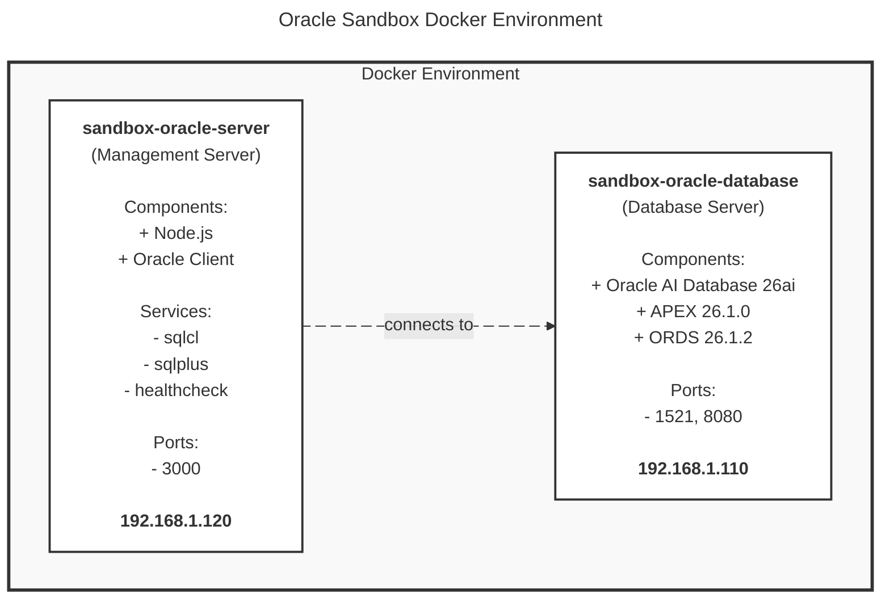

# 🚀 Oracle Sandbox – Developer Environment

<div align="center">

[](LICENSE)

[](https://www.oracle.com/database/free/)

[](https://nodejs.org)
[](https://apex.oracle.com)
[](https://www.oracle.com/database/technologies/appdev/rest.html)
[](https://www.oracle.com/database/sqldeveloper/technologies/sqlcl/)
[](https://github.com/demasy)

</div>

<br>

# Overview

The **Oracle AI Database 26ai Free - Developer Environment** offers a clean, fully containerized development stack designed for modern application development, in-depth technical learning, and hands-on exploration of Oracle's latest AI-powered capabilities. By combining **Oracle Database 26ai Free**, **APEX 26.1.0**, **ORDS 26.1.2**, and **SQLcl** into a unified Docker-based environment, this setup simplifies installation. It provides a consistent, reproducible workspace across macOS, Linux, and Windows WSL2 environments.

This environment is specifically tailored for **PL/SQL developers**, **APEX builders**, **database administrators (DBAs)**, **architects**, **instructors**, and the broader **Oracle community**. It serves as a reliable and portable foundation for rapid prototyping, REST API development, workshops, and classroom training. Users can discover and test the latest features of Oracle Database 26ai, experiment with AI-enhanced SQL and application patterns, and build full-stack solutions all without requiring production-scale infrastructure.

Designed to facilitate learning through practical experience, this setup allows users to start instantly, iterate quickly, reset easily, and explore safely. With its isolated, predictable, and developer-friendly design, this environment **accelerates experimentation**, **promotes community adoption**, and **helps professionals** stay current with Oracle's evolving innovations. Whether you're showcasing **new features**, **teaching future Oracle developers**, **contributing to community knowledge**, or **building internal tools**, this environment provides a **fast**, **modern**, and **reliable** foundation for your projects.

<br>

> [!WARNING]
> **DEVELOPMENT AND TRAINING ENVIRONMENT ONLY**
> 
> This environment is intended solely for **development**, **testing**, **evaluation**, and **educational** purposes. It is not secured, hardened, or optimized for production workloads. For production-grade deployments, organizations should consult Oracle's official deployment guidelines and work with Oracle Support or certified Oracle partners to ensure appropriate architecture, security, and compliance.

<br>

# 📑 Table of Contents
- [Overview](#overview) 
- [Key Features](#key-features)
- [Use Cases](#use-cases)
- [Prerequisites](#prerequisites)
- [Getting Started](#getting-started)
- [Architecture](#architecture)
- [Built-in Tools & Scripts](#built-in-tools--scripts)
- [📖 Sandbox CLI User Guide](docs/cli/user-guide.md) ⭐ **START HERE FOR CLI**
- [MCP Server (Claude Code Integration)](#mcp-server-claude-code-integration)
- [Documentation](#-documentation)
- [Change Log / Release History](#change-log--release-history)
- [Contributors](#contributors)
- [License](#overview)

<br>

## Key Features
- Oracle Database 26ai Free, preconfigured for local development
- APEX 26.1.0 + ORDS 26.1.2 fully integrated and ready to use
- SQLcl & SQL*Plus included for scripting, labs, and automation
- Clean Docker Compose setup (Database + Management Server)
- Compatible with Linux, macOS (Intel/ARM), and Windows WSL2
- Simple environment variables and port mapping for easy configuration
- Built-in scripts for APEX installation, health checks, and utilities
- Developer-friendly structure ideal for training, demos, and workshops

<br>

## Use Cases

<br>

| Use Case | Description |
|----------|-------------|
| **Isolated Development and Testing Environment** | Reproducible, containerized Oracle instances that enable developers to test changes, isolate work streams, and keep clean project environments without impacting the local system. |
| **Technology Exploration and Feature Discovery** | A secure, isolated sandbox for exploring Oracle AI Database’s newest features, enhancements, and modern development workflows, enabling developers to learn through experimentation. |
| **Proof of Concept (POC)** | A flexible, temporary environment for creating prototypes, validating technical approaches, and showcasing Oracle AI Database capabilities without the complexity of a complete production infrastructure. |
| **APEX Application Development** | An all-in-one, low-code development platform featuring APEX 26.1.0, ORDS 26.1.2, and database services. Ideal for designing, testing, and deploying enterprise-level applications.|
| **Community, Collaboration, and Open Source** | A shared workspace that supports testing, collaborative projects, hackathons, knowledge exchange, and community-driven innovation within the Oracle ecosystem. |
| **Professional Training and Education** | A comprehensive, hands-on learning platform focusing on Oracle Database, SQL, PL/SQL, APEX, and Oracle REST Data Services (ORDS). Perfect for instructors, workshops, bootcamps, certification preparation, and Oracle community training projects.|

<br>

## Prerequisites

<br>

### 🖥️ Host System Requirements

| Resource             | Minimum                            | Recommended                 |
|-----------------     |------------------                  |-----------------------------|
| **Operating System** | Linux, macOS (Intel/ARM), or Windows WSL2 | Linux, macOS (Intel/ARM), or Windows with WSL2 |
| **CPU**              | 2 cores (x86_64 or ARM64)          | 4+ cores (x86_64 or ARM64)  |
| **RAM**              | 6 GB                               | **12 GB or more**           |
| **Disk Space**       | 15 GB free                         | 25+ GB available disk space |
| **Swap Space**       | 2 GB                               | 4 GB (or twice RAM)         |
| **Docker Engine**    | 24.0.0 or later                    | 26.0.0 or later             |
| **Docker Compose**   | v2.20.0 or later                   | v2.30.0 or later            |
| **Java Runtime**     | OpenJDK 11 or later                | OpenJDK 17 LTS (included in image) |


<br>

### Software Requirements

- **Docker Desktop** (or Docker Engine + Docker Compose): Required for running and managing all containers.
- **Git**: Used for cloning the repository and pulling updates.
- **Visual Studio Code**: Ideal for editing configuration files, environment variables, and scripts. It also offers excellent support through Docker and SQL/PLSQL extensions.
- **Modern Web Browser**: Necessary for accessing APEX and ORDS. Supported browsers include Chrome, Firefox, Edge, and Safari.

<br>

### Network and Port Requirements

- **Internet Connection:** Required to download Docker images during the initial setup.
- **Docker Network:** The default subnet is 192.168.1.0/24 (this is customizable in the docker-compose.yml file).
- **Firewall Permissions:** Docker must be granted permission to create and manage local container networks.
- **Open Host Ports:** Ensure that the following ports are not in use by other services:

<div style="padding: 10px;">
  
| Port | Service | Status | Notes |
|------|---------|--------|-------|
| 1521 | Oracle Database Listener (TNS) | ✅ Active | Database connectivity |
| 3000 | Management Server (Health Check & API) | ✅ Active | Node.js application server |
| 8080 | APEX & ORDS Web Interface | ✅ Active | Low-code development, REST APIs |
| 3001 | MCP Connection Port (Optional) | ✅ Available | Claude Code integration |

</div>
  
<br>

> [!NOTE]
> - Oracle Database, SQLcl, and SQL*Plus are pre-installed in the container - no separate installation required.
> - Oracle APEX and ORDS can be installed manually using the `sandbox install apex` command.

<br>

## Getting Started

<br>

> [!IMPORTANT]
> **⚠️ SECURITY WARNINGS - READ BEFORE FIRST USE**
> 
> **CRITICAL SECURITY STEPS:**
> 1. **Change ALL default passwords** in `.env` file before starting containers
> 2. **Never commit** your `.env` file to version control (already in `.gitignore`)
> 3. **Use strong passwords**: Minimum 12 characters with mixed case, numbers, and symbols
> 4. **Restrict network access**: Bind services to `localhost` only for local development
> 5. **Keep software updated**: Regularly pull the latest Oracle images and update components.
> 
> **Template credentials in `.env.example` are placeholders - you MUST change them!**

<br>

### 🔐 Security Setup (REQUIRED FIRST STEP)

**Before starting containers, you MUST configure secure credentials:**

```bash
# 1. Copy the example environment file
cp .env.example .env

# 2. Edit .env and change ALL passwords
nano .env  # or use your preferred editor

# Required changes:
# - ENV_DB_PASSWORD=YOUR_SECURE_PASSWORD_HERE
# - ENV_APEX_ADMIN_PASSWORD=YOUR_SECURE_PASSWORD_HERE
# - ENV_APEX_ADMIN_EMAIL=your.email@example.com

# 3. Verify .env is not tracked by git
git status  # Should NOT show .env file
```

**Password Requirements:**
- Minimum 12 characters
- Mix of uppercase and lowercase letters
- Include numbers and special characters
- Avoid dictionary words and common patterns

**⚠️ Do not skip this step!** Default passwords are publicly known and insecure.

<br>

### 📦 Installation

<br>

### Setup Guide

<br>

#### Step 1: Clone Repository

```bash
git clone https://github.com/demasy/oracle-sandbox.git
cd oracle-sandbox
```

<br>

#### Step 2: Environment Configuration

##### Create Environment File

```bash
cp .env.example .env
chmod 600 .env
```

##### Configure Required Variables

Edit `.env` and set the following required parameters:

```bash
# Absolutely Required - Container Won't Start Without These
ENV_DB_PASSWORD=YourSecurePassword123!
ENV_DB_SID=FREE
ENV_DB_SERVICE=FREEPDB1
ENV_DB_CHARACTERSET=AL32UTF8
ENV_NETWORK_SUBNET=192.168.1.0/24
ENV_NETWORK_GATEWAY=192.168.1.1
ENV_IP_DB_SERVER=192.168.1.110
ENV_IP_APP_SERVER=192.168.1.120
ENV_DB_PORT_LISTENER=1521
ENV_SERVER_PORT=3000
ENV_DB_POOL_MIN=1
ENV_DB_POOL_MAX=5
ENV_DB_POOL_INCREMENT=1
ENV_DB_USER=system
ENV_DB_CLIENT=/opt/oracle/instantclient
ENV_DB_CPU_LIMIT=2
ENV_DB_MEMORY_LIMIT=4g
ENV_SERVER_CPU_LIMIT=3.0
ENV_SERVER_MEMORY_LIMIT=3g
ENV_SRC_ORACLE_SQLCL=https://download.oracle.com/otn_software/java/sqldeveloper/sqlcl-latest.zip
ENV_SRC_ORACLE_SQLPLUS=https://download.oracle.com/otn_software/linux/instantclient/2390000/instantclient-sqlplus-linux.arm64-23.9.0.25.07.zip
ENV_SRC_ORACLE_APEX=https://download.oracle.com/otn_software/apex/apex-latest.zip
ENV_SRC_ORACLE_ORDS=https://download.oracle.com/otn_software/java/ords/ords-latest.zip

# Required Only If Using APEX
ENV_APEX_ADMIN_PASSWORD=YourAPEXPassword123
ENV_APEX_ADMIN_USERNAME=ADMIN
ENV_APEX_EMAIL=your-email@example.com
ENV_APEX_DEFAULT_WORKSPACE=SANDBOX
```

> **Security Best Practices:**
> - Use strong passwords with mixed case, numbers, and symbols
> - Never commit `.env` files to version control
> - Restrict file permissions to owner only (`chmod 600`)
> - Rotate passwords regularly in production environments
> - Use different credentials for each environment

<br>

#### Step 3: Build Services

Build the Docker images with a clean build:

```bash
docker-compose build --no-cache
```

<br>

#### Step 4: Start Services

##### Option A: Production Mode (Recommended)

Start all services in detached mode:

```bash
docker-compose up -d
```

##### Option B: Development Mode

Start with real-time logs for debugging:

```bash
docker-compose up
```

To stop, press `Ctrl+C` and run:
```bash
docker-compose down
```

##### Option C: Selective Services

Start only specific services:

```bash
# Database only
docker-compose up -d sandbox-oracle-database

# Management server only
docker-compose up -d sandbox-oracle-server
```

<br>

#### Step 5: Verify Installation

##### 1. Check Container Status

```bash
docker ps --filter "name=sandbox-oracle-database" --filter "name=sandbox-oracle-server"
```

**Expected output:**
```
CONTAINER ID   IMAGE                                               STATUS                    PORTS                                          NAMES
abc123def456   container-registry.oracle.com/database/free:latest  Up 2 minutes (healthy)    localhost:1521->1521/tcp                        sandbox-oracle-database
def456ghi789   sandbox-oracle-sandbox:latest                       Up 2 minutes (healthy)    localhost:3000->3000/tcp, localhost:8080->8080  sandbox-oracle-server
```

##### 2. Wait for Database Initialization

Monitor database startup (takes 5-10 minutes on first run):

```bash
docker logs -f sandbox-oracle-database
```

**Look for:** `DATABASE IS READY TO USE!`

##### 3. Verify Health Endpoints

Test the management server:

```bash
curl http://localhost:3000/health
```

**Expected response:**
```json
{
  "status": "healthy",
  "service": "oracle-sandbox-management",
  "uptimeSeconds": 42,
  "checks": {
    "configuration": {
      "status": "pass",
      "missingEnv": []
    }
  }
}
```

##### 4. Test Database Connection

Access the management container:

```bash
docker exec -it sandbox-oracle-server bash
```

Connect to the database:

```bash
sandbox run sqlcl
```

Expected output: 

```
Connected to:
Oracle AI Database 26ai Free Release 23.26.0.0.0 - Develop, Learn, and Run for Free
Version 23.26.0.0.0
SQL>
```

<br>

### Quick Start

```bash
# 1. Clone and setup
git clone https://github.com/demasy/oracle-sandbox.git
cd oracle-sandbox
cp .env.example .env
# Edit .env with your configuration

# 2. Build and start
docker-compose build --no-cache
docker-compose up -d

# 3. Verify
docker ps
docker logs -f sandbox-oracle-database  # Wait for "READY TO USE"
curl http://localhost:3000/health

# 4. (Optional) Install APEX and ORDS
sandbox install apex

# APEX / ORDS Web UI: open http://localhost:8080 (or your configured port) in a browser


# 5. Connect
sandbox run sqlcl
```

<br>

## 🛠️ Available Management Tools

Once your Oracle Sandbox is running and APEX is installed, access these management interfaces:

| Tool | URL | Purpose |
|------|-----|---------|
| **APEX Application Builder** | `http://localhost:8080/ords/f?p=4550:1` | Low-code application development, APEX dashboard |
| **SQL Developer Web** | `http://localhost:8080/ords/sandbox/_sdw/` | Browser-based SQL development and execution |
| **APEX Admin Console** | `http://localhost:8080/ords/apex_admin` | Workspace management, user administration, settings |
| **ORDS REST API** | `http://localhost:8080/ords/` | RESTful data access, API documentation, services |
| **Health Check** | `http://localhost:3000/health` | System diagnostics and configuration validation |
| **Database Connectivity** | `localhost:1521` (FREEPDB1) | Direct SQL*Plus, SQLcl, or SQL Developer connections |

### APEX Access Credentials

> **Passwords are set in your `.env` file** (`ENV_APEX_ADMIN_PASSWORD`, `ENV_DB_PASSWORD`). The values below show the variable name — replace with your configured password.

#### APEX Admin
| Property | Value |
|----------|-------|
| **URL** | `http://localhost:8080/ords/apex_admin` |
| **Workspace** | `INTERNAL` |
| **Username** | `ADMIN` |
| **Password** | See `ENV_APEX_ADMIN_PASSWORD` in `.env` |

#### APEX Developer Workspace
| Property | Value |
|----------|-------|
| **URL** | `http://localhost:8080/ords/f?p=4550:1` |
| **Workspace** | `SANDBOX` |
| **Username** | `ADMIN` |
| **Password** | See `ENV_APEX_ADMIN_PASSWORD` in `.env` |

#### SQL Developer Web
| Property | Value |
|----------|-------|
| **URL** | `http://localhost:8080/ords/sandbox/_sdw/` |
| **Username** | `SANDBOX` |
| **Password** | See `ENV_DB_PASSWORD` in `.env` |

#### Database Connection
| Property | Value |
|----------|-------|
| **Host** | `localhost` |
| **Port** | `1521` |
| **Service / PDB** | `FREEPDB1` |
| **User** | `system` |
| **Password** | See `ENV_DB_PASSWORD` in `.env` |

### APEX Management Commands

```bash
# Start APEX and ORDS services
sandbox start apex

# Stop APEX and ORDS services
sandbox stop apex

# Restart APEX and ORDS services
sandbox restart apex

# View ORDS logs
sandbox logs ords

# View APEX installation logs
sandbox logs apex

# Reinstall APEX (if needed)
sandbox install apex
```

### Command-Line Access

```bash
# Connect with SQLcl
sandbox run sqlcl

# Connect with SQL*Plus
sandbox run sqlplus system@FREEPDB1

# Run monitoring scripts
sandbox run monitor active-connections
sandbox run monitor database-size
sandbox run monitor tablespace-usage

# Run arbitrary SQL
sandbox run sqlcl <<EOF
CONNECT system/password@192.168.1.110:1521/FREEPDB1
SELECT * FROM dba_users;
EXIT;
EOF
```

### External Database Tools

Connect from your local machine using:

- **SQL Developer** (download from Oracle)
- **DBeaver** (free version available)
- **DataGrip** (JetBrains IDE)
- **VS Code** (with Oracle extension)

**Connection Details:**
- **Host:** localhost (or 127.0.0.1)
- **Port:** 1521
- **Service Name:** FREEPDB1
- **Username:** system
- **Password:** See `ENV_DB_PASSWORD` in `.env`

### APEX Troubleshooting

**If APEX images are not loading:**
1. Restart APEX and ORDS:
   ```bash
   sandbox restart apex
   ```
2. Check ORDS logs for errors:
   ```bash
   sandbox logs ords
   ```
3. Verify APEX workspace users are unlocked:
   ```bash
   sandbox run sqlcl
   SQL> SELECT username, account_status FROM dba_users WHERE username LIKE 'APEX%' OR username LIKE 'ORDS%';
   ```

**If connection errors occur:**
1. Check that containers are running:
   ```bash
   docker compose ps
   ```
2. Verify database health:
   ```bash
   sandbox run healthcheck
   ```
3. Reinstall APEX if needed:
   ```bash
   sandbox install apex
   ```

**For complete APEX documentation and troubleshooting:**
- See [Oracle APEX Installation](docs/database/apex-installation.md)
- See [Troubleshooting Guide](docs/operations/troubleshooting.md)

<br>

# Architecture
The environment consists of two primary containerized services:

<br>

#### Docker Architecture Diagram




    

<br>

#### Database Service (`sandbox-oracle-database`)

| Component | Details |
|-----------|---------|
| Base Image | Oracle AI Database 26ai Free Edition |
| Container Name | `sandbox-oracle-database` |
| Database Name | FREEPDB1 (Pluggable Database) |
| Exposed Ports | • 1521 (TNS Listener) |
| Network | 192.168.1.110 |
| Resources | • CPU: 2 cores<br>• Memory: 4GB |
| Health Check | Every 30s via SQL connectivity test |

<br>

#### Management Server (`sandbox-oracle-server`)

| Component | Details |
|-----------|---------|
| Base Image | Node.js 20.19.4 |
| Container Name | `sandbox-oracle-server` |
| Exposed Port | 3000 (API & Health Check) |
| Network | 192.168.1.120 |
| Resources | • CPU: 2 cores<br>• Memory: 2GB |
| Integrations | • Oracle SQLcl<br>• Oracle APEX<br>• Oracle Instant Client 23.7<br>• Node.js 20 LTS |
| Connection Pool | • Min: 1<br>• Max: 5<br>• Increment: 1 |


<br>

#### 📋 Version Information

| Component | Version | Release Date | Status |
|-----------|---------|--------------|--------|
| Oracle AI Database | 26ai Free | 2025 | ✅ Production-Ready |
| Oracle APEX | 26.1.0 | 2025 | ✅ Current Release |
| Oracle ORDS | 26.1.2 | 2025 | ✅ Current Release |
| Oracle SQLcl | 26.1 | 2025 | ✅ Current Release |
| Oracle Instant Client | 23.7 | 2024 | ✅ Stable |
| Node.js | 20.19.4 LTS | 2024 | ✅ Long-Term Support |
| Docker Engine | 24.0.0+ | - | ✅ Required |
| Docker Compose | v2.20.0+ | - | ✅ Required |

<br>

#### 🖥️ Platform Compatibility

| Platform | Architecture | SQL*Plus | SQLcl | APEX | Status |
|----------|-------------|:----------:|:-------:|:------:|--------|
| **Linux (Ubuntu/Debian)** | AMD64 (x86_64) | ✅ | ✅ | ✅ | Fully Supported |
| **Linux (Ubuntu/Debian)** | ARM64 (aarch64) | ⚠️ Fallback | ✅ | ✅ | Supported |
| **macOS (Intel)** | AMD64 (x86_64) | ✅ | ✅ | ✅ | Fully Supported |
| **macOS (Apple Silicon)** | ARM64 (M1/M2/M3) | ⚠️ Fallback | ✅ | ✅ | Supported |
| **Windows (WSL2)** | AMD64 (x86_64) | ✅ | ✅ | ✅ | Supported |

<br>

> [!NOTE]
> SQL*Plus is not natively available on ARM64. SQLcl is automatically used as a fallback.

<br>

## Built-in Tools & Scripts

All scripts are organized in a structured directory layout for better maintainability:

**Container Path Structure:**
```
/usr/sandbox/app/
├── cli/                    # User-facing CLI tools
│   └── sandbox.sh          # Main sandbox CLI
│
├── system/
│   ├── admin/              # Health and diagnostics
│   ├── download/           # Oracle component download helpers
│   ├── install/            # Oracle client install helpers
│   └── utils/              # Shared shell utilities
│
├── oracle/
│   ├── admin/              # Administrative tools
│   │   ├── create-pdb.sh
│   │   └── create-user.sh
│   │
│   ├── apex/               # APEX management
│   │   ├── install.sh      # APEX + ORDS installation
│   │   ├── uninstall.sh    # APEX removal
│   │   ├── start.sh        # Start ORDS
│   │   └── stop.sh         # Stop ORDS
│   │
│   ├── sqlcl/              # SQLcl connection helper
│   └── sqlplus/            # SQL*Plus connection helper

```

<br>

**Command Aliases:**

| Command Alias | Target Script | Purpose |
|-------|--------------|----------|
| `sandbox run sqlcl` | SQLcl connection tool | Connect via SQLcl |
| `sandbox run sqlplus` | SQL*Plus connection tool | Connect via SQL*Plus |
| `sandbox run monitor` | Monitoring script runner | Execute database monitoring scripts |
| `sandbox healthcheck` | Health diagnostics | Run health check |
| `sandbox install apex` | APEX & ORDS installer | Install APEX and ORDS |
| `sandbox start apex` | ORDS service | Start ORDS after APEX installation |
| `sandbox stop apex` | ORDS service | Stop ORDS after APEX installation |

<br>

> [!NOTE]
> All scripts are organized using best practices with a flat structure (max three levels). For detailed documentation, see `src/scripts/README.md`.

<br>

## MCP Server (Claude Code Integration)

The sandbox includes a built-in **SQLcl MCP server** that lets Claude Code query the Oracle database directly using natural language. It runs inside the `sandbox-oracle-server` container and communicates via the Model Context Protocol (stdio).

<br>

### How It Works

```
Claude Code  ──stdio──►  docker exec sandbox-oracle-server start-mcp
                                        │
                                   SQLcl -mcp
                                        │
                               sandbox-ai-conn (SANDBOX_PDB)
                                        │
                            Oracle Database 26ai Free
```

<br>

### Step 1 — Start the Container

```bash
docker compose up -d
```

Verify both containers are healthy:

```bash
docker ps --filter name=sandbox-oracle-server --format "{{.Names}}\t{{.Status}}"
```

**Expected:**
```
sandbox-oracle-server   Up X minutes (healthy)
```

<br>

### Step 2 — Start the MCP Server in Claude Code

Open the Command Palette: **`Cmd + Shift + P`** (macOS) / **`Ctrl + Shift + P`** (Windows/Linux)

Type `MCP` → select **`MCP: Restart MCP Server`** → choose:

```
sandbox-sqlcl-mcp   (oracle-sandbox/.mcp.json)
```

Status should change to **Running**.

<br>

### Step 3 — Connect to the Database

Ask Claude:

```
connect to sandbox-ai-conn using the MCP server
```

> [!NOTE]
> The connect tool returns an error message — this is a known upstream SQLcl MCP behaviour. **The connection is established successfully despite the error.** Proceed to run queries normally.

<br>

### Step 4 — Run a Query

Ask Claude:

```
Using the sandbox-sqlcl-mcp MCP server, run:
select user from dual;
```

**Expected result:**

```
USER
------------
SANDBOX_AI
```

<br>

### Available MCP Tools

| Tool | Purpose |
|------|---------|
| `connect` | Establish database connection (call once per session) |
| `run-sql` | Execute SQL queries (`SELECT`, `INSERT`, `UPDATE`, etc.) |
| `run-sqlcl` | Execute SQLcl commands (`DESC`, `SET`, `SHOW`, etc.) |
| `list-connections` | List available saved connections |

<br>

### MCP Connection Details

| Property | Value |
|----------|-------|
| Connection Name | `sandbox-ai-conn` |
| Database User | `SANDBOX_AI` |
| Target PDB | `SANDBOX_PDB` |
| Config File | `.mcp.json` |
| Start Script | `src/builder/scripts/oracle/mcp/start.sh` |

<br>

> [!NOTE]
> The MCP server credentials are read from the container's environment variables (`SANDBOX_DB_MCP_USER`, `SANDBOX_DB_MCP_SERVICE`, etc.) defined in your `.env` file. The saved connection `sandbox-ai-conn` is refreshed automatically on every MCP server start.

<br>

## 📚 Documentation

Full documentation index: **[docs/README.md](docs/README.md)**

### 🖥️ CLI

| Document | Description |
|----------|-------------|
| **[Sandbox CLI User Guide](docs/cli/user-guide.md)** ⭐ | Complete reference for all `sandbox` commands, aliases, flags, and workflows |
| [Quick Reference](docs/quick-reference.md) | One-page cheat sheet — commands, ports, URLs, connection strings |
| [FAQ](docs/faq.md) | Common questions about setup, connections, APEX, MCP, and performance |
| [CLI Testing Guide](docs/cli/testing.md) | Test procedures, performance monitoring, and CI/CD integration |

### 🗄️ Database

| Document | Description |
|----------|-------------|
| [APEX Installation](docs/database/apex-installation.md) | APEX + ORDS setup, endpoints, and management commands |
| [Database Connectivity](docs/database/connectivity.md) | SQLcl, SQL*Plus, and connection string formats |
| [External Access](docs/database/external-access.md) | Connecting from host tools (SQL Developer, DBeaver, DataGrip) |

### ⚙️ Operations

| Document | Description |
|----------|-------------|
| [Configuration Reference](docs/operations/configuration-reference.md) | All `ENV_*` variables, resource limits, volumes, and port mapping |
| [Startup Configuration](docs/operations/startup-configuration.md) | APEX auto-install, startup timeouts, and boot behavior |
| [Service Management](docs/operations/service-management.md) | Container start/stop/restart, health checks, and diagnostics |
| [Monitoring & Logs](docs/operations/monitoring.md) | Health checks, log management, and resource monitoring |
| [Troubleshooting](docs/operations/troubleshooting.md) | Common issues and solutions |
| [Deployment Guide](docs/operations/deployment-guide.md) | Build, deploy, and operate the sandbox environment |
| [Tools Reference](docs/operations/tools-reference.md) | Built-in scripts and utilities reference |
| [Docker Publishing](docs/operations/docker-publishing.md) | Docker image publishing and versioning |

### 🔒 Security

| Document | Description |
|----------|-------------|
| [Security Guide](docs/security/security.md) | Security best practices for this environment |
| [Security Audit](docs/security/security-audit.md) | Security assessment and findings |
| [Production Hardening](docs/security/production-hardening.md) | Enterprise hardening checklist |

<br>

## Change Log / Release History

<br>

| Version | Date       | Type     | Description                                                                                       |
|---------|------------|----------|---------------------------------------------------------------------------------------------------|
| v1.0.1  | 2025-12-01 | Fix      | Fix Docker build process with automatic Oracle Client download during build. |
| v1.0.0  | 2025-11-30 | Release  | **Foundation Release** initial public release including Oracle 26ai Free, APEX 24.2, ORDS 25.3, SQLcl, Docker Compose setup, core scripts, and full documentation. |


<br>

### [v1.0.0] – 2025-11-30

#### Added
- Oracle Database 26ai Free container image  
- APEX 24.2, ORDS 25.3, SQLcl integration  
- Docker Compose setup (DB + Management Server)  
- Core shell scripts via sandbox CLI (healthcheck, install apex, sqlcl/sqlplus, and more)  
- Complete documentation, including architecture diagram, environment variable descriptions, usage instructions, and directory structure  

### [v1.0.1] – 2025-12-01
- Fix Docker build process with automatic Oracle Client downloads
- Centralize banner display across all scripts
- Fix symlink resolution in scripts

<br>

## Contributors


| Author | GitHub & LinkedIn account |
| :-  | :---- |
| <div align="center">  <br> **Ahmed El-Demasy** (Creator & Maintainer) <br> Oracle Solutions Architect <br> Oracle ACE </div> | <div align="center"> <a href="https://github.com/demasy">Github</a> & <a href="https://www.linkedin.com/in/demasy">LinkedIn</a> </div> |

<br>

### Contributing to the "Oracle Sandbox – Developer Environment". 
We welcome you to join and contribute to the "🚀 **Oracle Sandbox – Developer Environment** 🚀". If you are interested in helping, please don’t hesitate to contact us at founder@demasy.io

<br>

###### Suggestions & Issues
> If you find any issues or have a great idea in mind, please create an issue on <a href="https://github.com/demasy/oracle-sandbox/issues">GitHub</a>.

<br>

## License

This project is licensed under the MIT License - see the [LICENSE](LICENSE) file for details.

<br>


> [!IMPORTANT]
> ## Disclaimer
> This project is an independent development and is not affiliated with, endorsed by, or supported by Oracle Corporation. Oracle Corporation owns Oracle Database, Oracle APEX, Oracle ORDS, and related trademarks. Please use Oracle Database Free Edition in accordance with Oracle's license terms.

</br>

</br>

<!--

-->
<p align="center">
Code with love ❤️ in Egypt for the Oracle development community.
</p>
