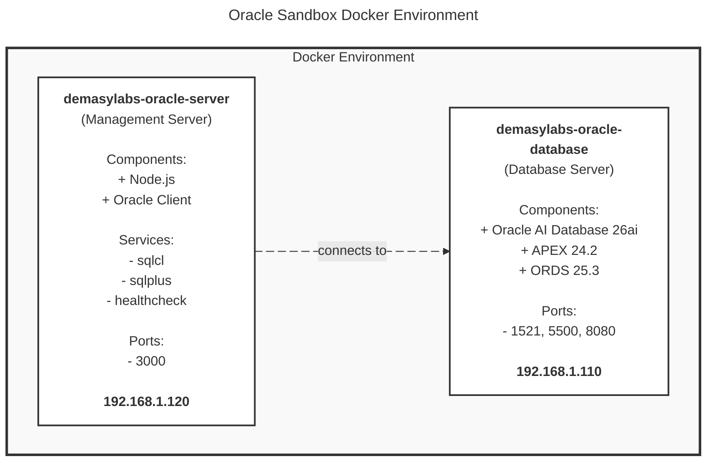

# 🚀 Oracle Sandbox – Developer Environment

<div align="center">

[](LICENSE)

[](https://www.oracle.com/database/free/)

[](https://nodejs.org)
[](https://apex.oracle.com)
[](https://www.oracle.com/database/technologies/appdev/rest.html)
[](https://www.oracle.com/database/sqldeveloper/technologies/sqlcl/)
[](https://github.com/demasy)

</div>

<br>

# Overview

The **Oracle AI Database 26ai Free - Developer Environment** offers a clean, fully containerized development stack designed for modern application development, in-depth technical learning, and hands-on exploration of Oracle's latest AI-powered capabilities. By combining **Oracle Database 26ai Free**, **APEX 24.2**, **ORDS 25.3**, and **SQLcl** into a unified Docker-based environment, this setup simplifies installation. It provides a consistent, reproducible workspace across macOS, Linux, and Windows WSL2 environments.

This environment is specifically tailored for **PL/SQL developers**, **APEX builders**, **database administrators (DBAs)**, **architects**, **instructors**, and the broader **Oracle community**. It serves as a reliable and portable foundation for rapid prototyping, REST API development, workshops, and classroom training. Users can discover and test the latest features of Oracle Database 26ai, experiment with AI-enhanced SQL and application patterns, and build full-stack solutions all without requiring production-scale infrastructure.

Designed to facilitate learning through practical experience, this setup allows users to start instantly, iterate quickly, reset easily, and explore safely. With its isolated, predictable, and developer-friendly design, this environment **accelerates experimentation**, **promotes community adoption**, and **helps professionals** stay current with Oracle's evolving innovations. Whether you're showcasing **new features**, **teaching future Oracle developers**, **contributing to community knowledge**, or **building internal tools**, this environment provides a **fast**, **modern**, and **reliable** foundation for your projects.

<br>

> [!WARNING]
> **DEVELOPMENT AND TRAINING ENVIRONMENT ONLY**
> 
> This environment is intended solely for **development**, **testing**, **evaluation**, and **educational** purposes. It is not secured, hardened, or optimized for production workloads. For production-grade deployments, organizations should consult Oracle's official deployment guidelines and work with Oracle Support or certified Oracle partners to ensure appropriate architecture, security, and compliance.

<br>

# 📑 Table of Contents
- [Overview](#overview) 
- [Key Features](#key-features)
- [Use Cases](#use-cases)
- [Prerequisites](#prerequisites)
- [Getting Started](#getting-started)
- [Architecture](#architecture)
- [Built-in Tools & Scripts](#built-in-tools--scripts)
- [Documentation](https://github.com/demasy/oracle-database/tree/main/src/docs)
- [Change Log / Release History](#change-log--release-history)
- [Contributors](#contributors)
- [License](#overview)

<br>

## Key Features
- Oracle Database 26ai Free, preconfigured for local development
- APEX 24.2 + ORDS 25.3 fully integrated and ready to use
- SQLcl & SQL*Plus included for scripting, labs, and automation
- Clean Docker Compose setup (Database + Management Server)
- Compatible with Linux, macOS (Intel/ARM), and Windows WSL2
- Simple environment variables and port mapping for easy configuration
- Built-in scripts for APEX installation, health checks, and utilities
- Developer-friendly structure ideal for training, demos, and workshops

<br>

## Use Cases

<br>

| Use Case | Description |
|----------|-------------|
| **Isolated Development and Testing Environment** | Reproducible, containerized Oracle instances that enable developers to test changes, isolate work streams, and keep clean project environments without impacting the local system. |
| **Technology Exploration and Feature Discovery** | A secure, isolated sandbox for exploring Oracle AI Database’s newest features, enhancements, and modern development workflows, enabling developers to learn through experimentation. |
| **Proof of Concept (POC)** | A flexible, temporary environment for creating prototypes, validating technical approaches, and showcasing Oracle AI Database capabilities without the complexity of a complete production infrastructure. |
| **APEX Application Development** | An all-in-one, low-code development platform featuring APEX 24.2, ORDS 25.3, and database services. Ideal for designing, testing, and deploying enterprise-level applications.|
| **Community, Collaboration, and Open Source** | A shared workspace that supports testing, collaborative projects, hackathons, knowledge exchange, and community-driven innovation within the Oracle ecosystem. |
| **Professional Training and Education** | A comprehensive, hands-on learning platform focusing on Oracle Database, SQL, PL/SQL, APEX, and Oracle REST Data Services (ORDS). Perfect for instructors, workshops, bootcamps, certification preparation, and Oracle community training projects.|

<br>

## Prerequisites

<br>

### 🖥️ Host System Requirements

| Resource             | Minimum                            | Recommended                 |
|-----------------     |------------------                  |-----------------------------|
| **Operating System** | -                                  | Linux, macOS, or Windows with WSL2 |
| **CPU**              | 2 cores (x86_64 or ARM64)          | 2+ cores (x86_64 or ARM64)  |
| **RAM**              | 4 GB                               | **8 GB or more**            |
| **Disk Space**       | 12 GB free                         | 20+ GB available disk space |
| **Swap Space**       | -                                  | 2 GB (or twice RAM)         |
| **Docker Engine**    | -                                  | 24.0.0 or later             |
| **Docker Compose**   | -                                  | v2.20.0 or later            |


<br>

### Software Requirements

- **Docker Desktop** (or Docker Engine + Docker Compose): Required for running and managing all containers.
- **Git**: Used for cloning the repository and pulling updates.
- **Visual Studio Code**: Ideal for editing configuration files, environment variables, and scripts. It also offers excellent support through Docker and SQL/PLSQL extensions.
- **Modern Web Browser**: Necessary for accessing APEX and ORDS. Supported browsers include Chrome, Firefox, Edge, and Safari.

<br>

### Network and Port Requirements

- **Internet Connection:** Required to download Docker images during the initial setup.
- **Docker Network:** The default subnet is 192.168.1.0/24 (this is customizable in the docker-compose.yml file).
- **Firewall Permissions:** Docker must be granted permission to create and manage local container networks.
- **Open Host Ports:** Ensure that the following ports are not in use by other services:

<div style="padding: 10px;">
  
| Port | Service | Protocol |
|------|---------|----------|
| 3000 | Demasy Labs Management Server | HTTP |
| 8080 / 8443 | ORDS and APEX web access | HTTP |
| 1521 | Oracle Database Listener | TCP |
| 5500 | Enterprise Manager (optional) | HTTP |
| 3000 | Management API | HTTP |
| 8080 | Oracle ORDS/APEX | HTTP |

</div>
  
<br>

> [!NOTE]
> - Oracle Database, SQLcl, and SQL*Plus are pre-installed in the container - no separate installation required.
> - Oracle APEX and ORDS must be installed manually using the provided script inside the container.  ```bash /usr/demasy/scripts/apex/install-apex.sh ```

<br>

## Getting Started

<br>

> [!IMPORTANT]
> **⚠️ SECURITY WARNINGS - READ BEFORE FIRST USE**
> 
> **CRITICAL SECURITY STEPS:**
> 1. **Change ALL default passwords** in `.env` file before starting containers
> 2. **Never commit** your `.env` file to version control (already in `.gitignore`)
> 3. **Use strong passwords**: Minimum 12 characters with mixed case, numbers, and symbols
> 4. **Restrict network access**: Bind services to `localhost` only for local development
> 5. **Keep software updated**: Regularly pull the latest Oracle images and update components.
> 
> **Default credentials are publicly visible in `.env.example` - you MUST change them!**

<br>

### 🔐 Security Setup (REQUIRED FIRST STEP)

**Before starting containers, you MUST configure secure credentials:**

```bash
# 1. Copy the example environment file
cp .env.example .env

# 2. Edit .env and change ALL passwords
nano .env  # or use your preferred editor

# Required changes:
# - ENV_DB_PASSWORD=YOUR_SECURE_PASSWORD_HERE
# - ENV_APEX_ADMIN_PASSWORD=YOUR_SECURE_PASSWORD_HERE
# - ENV_APEX_ADMIN_EMAIL=your.email@example.com

# 3. Verify .env is not tracked by git
git status  # Should NOT show .env file
```

**Password Requirements:**
- Minimum 12 characters
- Mix of uppercase and lowercase letters
- Include numbers and special characters
- Avoid dictionary words and common patterns

**⚠️ Do not skip this step!** Default passwords are publicly known and insecure.

<br>

### 📦 Installation

<br>

### Setup Guide

<br>

#### Step 1: Clone Repository

```bash
git clone https://github.com/demasy/oracle-database.git
cd oracle-database
```

<br>

#### Step 2: Environment Configuration

##### Create Environment File

```bash
cp .env.example .env
chmod 600 .env
```

##### Configure Required Variables

Edit `.env` and set the following required parameters:

```bash
# Absolutely Required - Container Won't Start Without These
ENV_DB_PASSWORD=YourSecurePassword123!
ENV_DB_SID=FREE
ENV_DB_SERVICE=FREEPDB1
ENV_DB_CHARACTERSET=AL32UTF8
ENV_NETWORK_SUBNET=192.168.1.0/24
ENV_NETWORK_GATEWAY=192.168.1.1
ENV_IP_DB_SERVER=192.168.1.110
ENV_IP_APP_SERVER=192.168.1.120
ENV_DB_PORT_LISTENER=1521
ENV_SERVER_PORT=3000
ENV_DB_POOL_MIN=1
ENV_DB_POOL_MAX=5
ENV_DB_POOL_INCREMENT=1
ENV_DB_USER=system
ENV_DB_CLIENT=/opt/oracle/instantclient
ENV_DB_CPU_LIMIT=2
ENV_DB_MEMORY_LIMIT=4g
ENV_SERVER_CPU_LIMIT=3.0
ENV_SERVER_MEMORY_LIMIT=3g
ENV_SRC_ORACLE_SQLCL=https://download.oracle.com/otn_software/java/sqldeveloper/sqlcl-latest.zip
ENV_SRC_ORACLE_SQLPLUS=https://download.oracle.com/otn_software/linux/instantclient/2390000/instantclient-sqlplus-linux.arm64-23.9.0.25.07.zip
ENV_SRC_ORACLE_APEX=https://download.oracle.com/otn_software/apex/apex-latest.zip
ENV_SRC_ORACLE_ORDS=https://download.oracle.com/otn_software/java/ords/ords-latest.zip

# Required Only If Using APEX
ENV_APEX_ADMIN_PASSWORD=YourAPEXPassword123
ENV_APEX_ADMIN_USERNAME=ADMIN
ENV_APEX_EMAIL=your-email@example.com
ENV_APEX_DEFAULT_WORKSPACE=INTERNAL
```

> **Security Best Practices:**
> - Use strong passwords with mixed case, numbers, and symbols
> - Never commit `.env` files to version control
> - Restrict file permissions to owner only (`chmod 600`)
> - Rotate passwords regularly in production environments
> - Use different credentials for each environment

<br>

#### Step 3: Build Services

Build the Docker images with a clean build:

```bash
docker-compose build --no-cache
```

<br>

#### Step 4: Start Services

##### Option A: Production Mode (Recommended)

Start all services in detached mode:

```bash
docker-compose up -d
```

##### Option B: Development Mode

Start with real-time logs for debugging:

```bash
docker-compose up
```

To stop, press `Ctrl+C` and run:
```bash
docker-compose down
```

##### Option C: Selective Services

Start only specific services:

```bash
# Database only
docker-compose up -d demasylabs-oracle-database

# Management server only
docker-compose up -d demasylabs-oracle-server
```

<br>

#### Step 5: Verify Installation

##### 1. Check Container Status

```bash
docker ps --filter "name=demasylabs-oracle-database" --filter "name=demasylabs-oracle-server"
```

**Expected output:**
```
CONTAINER ID   IMAGE                                               STATUS                    PORTS                                              NAMES
abc123def456   container-registry.oracle.com/database/free:latest  Up 2 minutes (healthy)    0.0.0.0:1521->1521/tcp, 0.0.0.0:5500->5500/tcp   demasylabs-oracle-database
def456ghi789   demasylabs-oracle-sandbox:latest                    Up 2 minutes (healthy)    0.0.0.0:3000->3000/tcp, 0.0.0.0:8080->8080/tcp   demasylabs-oracle-server
```

##### 2. Wait for Database Initialization

Monitor database startup (takes 5-10 minutes on first run):

```bash
docker logs -f demasylabs-oracle-database
```

**Look for:** `DATABASE IS READY TO USE!`

##### 3. Verify Health Endpoints

Test the management server:

```bash
curl http://localhost:3000/health
```

**Expected response:**
```json
{
  "status": "healthy",
  "timestamp": "2025-11-25T12:00:00.000Z"
}
```

##### 4. Test Database Connection

Access the management container:

```bash
docker exec -it demasylabs-oracle-server bash
```

Connect to the database:

```bash
sqlcl
```

Expected output: 

```
Connected to:
Oracle AI Database 26ai Free Release 23.26.0.0.0 - Develop, Learn, and Run for Free
Version 23.26.0.0.0
SQL>
```

<br>

### Quick Start

```bash
# 1. Clone and setup
git clone https://github.com/demasy/oracle-database.git
cd oracle-database
cp .env.example .env
# Edit .env with your configuration

# 2. Build and start
docker-compose build --no-cache
docker-compose up -d

# 3. Verify
docker ps
docker logs -f demasylabs-oracle-database  # Wait for "READY TO USE"
curl http://localhost:3000/health

# 4. (Optional) Run the APEX & ORDS installer inside the database container
docker exec -it demasylabs-oracle-server bash
/usr/demasy/scripts/apex/install-apex.sh
exit

# APEX / ORDS Web UI: open http://localhost:8080 (or your configured port) in a browser


# 5. Connect
docker exec -it demasylabs-oracle-server sqlcl
```

<br>


# Architecture
The environment consists of two primary containerized services:

<br>

#### Docker Architecture Diagram




    

<br>

#### Database Service (`demasylabs-oracle-database`)

| Component | Details |
|-----------|---------|
| Base Image | Oracle AI Database 26ai Free Edition |
| Container Name | `demasylabs-oracle-database` |
| Database Name | DEMASY |
| Exposed Ports | • 1521 (Database Listener)<br>• 5500 (Enterprise Manager Express) |
| Network | 192.168.1.110 |
| Resources | • CPU: 1 core<br>• Memory: 3GB |
| Health Check | Every 30s via SQL connectivity test |

<br>

#### Management Server (`demasylabs-oracle-server`)

| Component | Details |
|-----------|---------|
| Base Image | Node.js 20.19.4 |
| Container Name | `demasylabs-oracle-server` |
| Exposed Port | 3000 (API & Health Check) |
| Network | 192.168.1.120 |
| Resources | • CPU: 1 core<br>• Memory: 512MB |
| Integrations | • Oracle SQLcl<br>• Oracle APEX<br>• Oracle Instant Client 23.7 |
| Connection Pool | • Min: 1<br>• Max: 5<br>• Increment: 1 |


<br>

#### 📋 Version Information

| Component | Version | Release Date | Status |
|-----------|---------|--------------|--------|
| Oracle AI Database | 26ai Free | 2025 | ✅ Production-Ready |
| Oracle APEX | 24.2.0 | October 2024 | ✅ Current Release |
| Oracle ORDS | 25.3.1 | November 2024 | ✅ Current Release |
| Oracle SQLcl | 25.3 | November 2024 | ✅ Current Release |
| Oracle Instant Client | 23.7 | 2024 | ✅ Stable |
| Node.js | 20.19.4 LTS | 2024 | ✅ Long-Term Support |
| Docker Engine | 24.0.0+ | - | ✅ Required |
| Docker Compose | v2.20.0+ | - | ✅ Required |

<br>

#### 🖥️ Platform Compatibility

| Platform | Architecture | SQL*Plus | SQLcl | APEX | Status |
|----------|-------------|:----------:|:-------:|:------:|--------|
| **Linux (Ubuntu/Debian)** | AMD64 (x86_64) | ✅ | ✅ | ✅ | Fully Supported |
| **Linux (Ubuntu/Debian)** | ARM64 (aarch64) | ⚠️ Fallback | ✅ | ✅ | Supported |
| **macOS (Intel)** | AMD64 (x86_64) | ✅ | ✅ | ✅ | Fully Supported |
| **macOS (Apple Silicon)** | ARM64 (M1/M2/M3) | ⚠️ Fallback | ✅ | ✅ | Supported |
| **Windows (WSL2)** | AMD64 (x86_64) | ✅ | ✅ | ✅ | Supported |

<br>

> [!NOTE]
> SQL*Plus is not natively available on ARM64. SQLcl is automatically used as a fallback.

<br>

## Built-in Tools & Scripts

All scripts are organized in a structured directory layout for better maintainability:

**Container Path Structure:**
```
/usr/demasy/scripts/
├── cli/                    # User-facing CLI tools
│   ├── sqlcl-connect.sh    # SQLcl database connection
│   └── sqlplus-connect.sh  # SQL*Plus connection
│
├── oracle/
│   ├── admin/              # Administrative tools
│   │   └── healthcheck.sh  # System health monitoring
│   │
│   ├── apex/               # APEX management
│   │   ├── install.sh      # APEX + ORDS installation
│   │   ├── uninstall.sh    # APEX removal
│   │   ├── start.sh        # Start ORDS
│   │   └── stop.sh         # Stop ORDS

```

<br>

**Command Aliases:**

| Command Alias | Target Script | Purpose |
|-------|--------------|----------|
| `sqlcl` | `/usr/demasy/scripts/cli/sqlcl-connect.sh` | Connect via SQLcl |
| `sqlplus` | `/usr/demasy/scripts/cli/sqlplus-connect.sh` | Connect via SQL*Plus |
| `oracle` | `/usr/demasy/scripts/cli/sqlcl-connect.sh` | Alias for SQLcl |
| `healthcheck` | `/usr/demasy/scripts/oracle/admin/healthcheck.sh` | Run health check |
| `install-apex` | `/usr/demasy/scripts/oracle/apex/install.sh` | Install APEX |
| `uninstall-apex` | `/usr/demasy/scripts/oracle/apex/uninstall.sh` | Remove APEX |
| `start-apex` | `/usr/demasy/scripts/oracle/apex/start.sh` | Start ORDS |
| `stop-apex` | `/usr/demasy/scripts/oracle/apex/stop.sh` | Stop ORDS |

<br>

> [!NOTE]
> All scripts are organized using best practices with a flat structure (max three levels). For detailed documentation, see `src/scripts/README.md`.

<br>

## 📚 Documentation

For comprehensive guides, see the [src/docs](src/docs) directory:

- [Service Management](src/docs/service-management.md) - Container operations, logs, and diagnostics
- [Oracle APEX Installation](src/docs/oracle-apex-installation.md) - APEX setup, ORDS configuration, and endpoints
- [Database Connectivity](src/docs/database-connectivity.md) - Connection methods, parameters, and examples
- [Monitoring & Logs](src/docs/monitoring.md) - Health checks, logging, and resource monitoring
- [Configuration Reference](src/docs/configuration-reference.md) - Environment variables and settings
- [Troubleshooting](src/docs/troubleshooting.md) - Common issues and solutions

<br>

## Change Log / Release History

<br>

| Version | Date       | Type     | Description                                                                                       |
|---------|------------|----------|---------------------------------------------------------------------------------------------------|
| v1.0.1  | 2025-12-01 | Fix      | Fix Docker build process with automatic Oracle Client download during build. |
| v1.0.0  | 2025-11-30 | Release  | **Foundation Release** initial public release including Oracle 26ai Free, APEX 24.2, ORDS 25.3, SQLcl, Docker Compose setup, core scripts, and full documentation. |


<br>

### [v1.0.0] – 2025-11-30

#### Added
- Oracle Database 26ai Free container image  
- APEX 24.2, ORDS 25.3, SQLcl integration  
- Docker Compose setup (DB + Management Server)  
- Core shell scripts (healthcheck, install-apex, SQLcl / SQL*Plus helpers)  
- Complete documentation, including architecture diagram, environment variable descriptions, usage instructions, and directory structure  

### [v1.0.1] – 2025-12-01
- Fix Docker build process with automatic Oracle Client downloads
- Centralize banner display across all scripts
- Fix symlink resolution in scripts

<br>

## Contributors


| Author | GitHub & LinkedIn account |
| :-  | :---- |
| <div align="center">  <br> **Ahmed El-Demasy** (Creator & Maintainer) <br> Oracle Solutions Architect <br> Oracle ACE </div> | <div align="center"> <a href="https://github.com/demasy">Github</a> & <a href="https://www.linkedin.com/in/demasy">LinkedIn</a> </div> |

<br>

### Contributing to the "Oracle Sandbox – Developer Environment". 
We welcome you to join and contribute to the "🚀 **Oracle Sandbox – Developer Environment** 🚀". If you are interested in helping, please don’t hesitate to contact us at founder@demasy.io

<br>

###### Suggestions & Issues
> If you find any issues or have a great idea in mind, please create an issue on <a href="https://github.com/demasy/oracle-database/issues">GitHub</a>.

<br>

## License

This project is licensed under the MIT License - see the [LICENSE](LICENSE) file for details.

<br>


> [!IMPORTANT]
> ## Disclaimer
> This project is an independent development and is not affiliated with, endorsed by, or supported by Oracle Corporation. Oracle Corporation owns Oracle Database, Oracle APEX, Oracle ORDS, and related trademarks. Please use Oracle Database Free Edition in accordance with Oracle's license terms.

</br>

</br>

<!--

-->
<p align="center">
Code with love ❤️ in Egypt for the Oracle development community.
</p>
